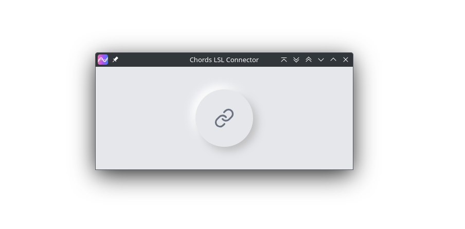

# Chords-LSL-Connector
Rust based LSL connector for device running Chords Firmware.

# Installation Instructions
### macOS  
If you see an error saying the app is "damaged or corrupted," it is likely due to macOS blocking unsigned apps. To bypass this:

1. **Disable Gatekeeper**:  
   macOS may block the app because it is not signed. To run the app, you will need to disable Gatekeeper temporarily. You can do this by following these steps:
   - Open **System Settings** → **Privacy & Security**.
   - Scroll down to **Security** and click **Allow Anyway** next to the message about the blocked app.

2. **Run the app**:  
   After allowing the app, try opening it again. You should be able to run it without further issues.

If you want to re-enable Gatekeeper after running the app, you can do so through the same settings menu.

### Windows  
If you see a warning saying "Microsoft Defender SmartScreen prevented an unrecognized app from starting. Running this app might put your PC at risk," it is likely due to Windows blocking unsigned apps. To bypass this:

1. Click **More Info** on the warning screen.
2. Click **Run Anyway** to continue and install the app.

This will allow the app to run without issues.

## Build instructions

1. `npm i`
2. `cargo tauri build`