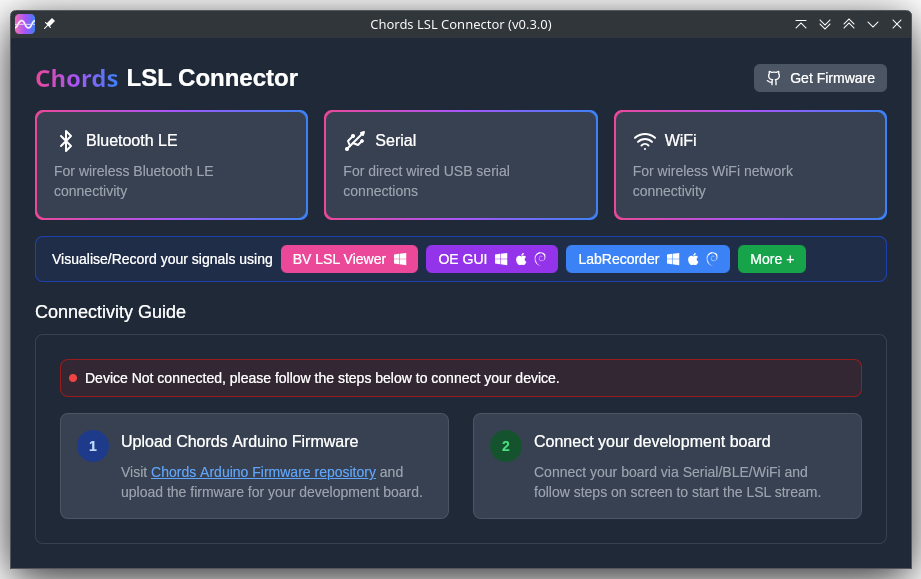

# Chords LSL Connector - User Guide



## Overview
Chords LSL Connector is a desktop application that connects to various bio-signal acquisition devices (Arduino-based) and streams data via Lab Streaming Layer (LSL) protocol for real-time visualization and recording.

**Version Management:** 
- To update the version, modify only the `version.json` file
- This ensures clean builds every time the version is updated across all necessary files

---

**Platforms Supported:** Windows 10/11, macOS, Linux

## Quick Start Guide

### 1. Installation

Download the latest installer for your operating system from the [Releases page](https://github.com/upsidedownlabs/Chords-LSL-Connector/releases):

- **Windows**: Run the `.msi` installer
- **macOS**: Open the `.dmg` file and drag the app to Applications
- **Linux**: Install the `.deb` or `.rpm` package

**Note for Windows Users:** If you see a warning from Microsoft Defender SmartScreen:
1. Click **More Info**
2. Click **Run Anyway**

### 2. Preparing Your Hardware

Before using the app, you need to upload firmware to your development board:

1. **Get the Firmware**: Click the **"Get Firmware"** button in the app or visit:
   - [Chords Arduino Firmware Repository](https://github.com/upsidedownlabs/Chords-Arduino-Firmware)

2. **Supported Boards**:
   - Arduino UNO R3/R4
   - Arduino Nano
   - Arduino Mega 2560
   - Raspberry Pi Pico (RP2040)
   - STM32 boards
   - NPG-Lite devices

3. **Upload Firmware** using Arduino IDE:
   - Open the appropriate `.ino` file for your board
   - Select correct board and port
   - Upload the firmware

### 3. Connecting Your Device

The app supports three connection methods:

#### **Serial (USB) Connection**
1. Connect your board to computer via USB cable
2. Click the **Serial** button in the app
3. The app will automatically detect and connect to your device
4. Connection status will show "Connected"

#### **Bluetooth LE Connection**
1. Ensure your board has Bluetooth capability
2. Click the **Bluetooth LE** button
3. App will scan for available devices
4. Select your device from the list (look for names containing "NPG")
5. Click to connect

#### **WiFi Connection**
1. Ensure your board is connected to WiFi network
2. Click the **WiFi** button
3. App will automatically connect to pre-configured WiFi devices

### 4. Monitoring Connection

Once connected, you'll see:
- **Real-time sampling rate** (Hz)
- **Samples lost** (if any)
- **Total samples** received
- **Live data visualization** on the graph

### 5. Visualizing/Recording Data

Use any LSL-compatible application to view or record your data:

#### **Recommended Applications:**

| Application | Platforms | Use Case |
|------------|-----------|----------|
| **Chords LSL Visualizer** | Windows, macOS, Linux | Real-time visualization and basic recording |
| **Open Ephys GUI** | Windows, macOS, Linux | Advanced neuroscience research |
| **LabRecorder** | Windows, macOS, Linux | Simple data recording |
| **Other LSL Viewers** | Various | Check [LSL documentation](https://labstreaminglayer.readthedocs.io/) |

**To open a viewer:**
1. Install your preferred LSL viewer application
2. Click the corresponding button in the Chords LSL Connector app
3. Start the viewer application
4. Look for streams named:
   - "UDL" (for Serial connections)
   - "NPG-Lite" (for Bluetooth/WiFi connections)

### 6. Troubleshooting

#### **No Devices Found**
- Ensure device is properly connected (USB cable plugged in, Bluetooth/WiFi enabled)
- Verify firmware is correctly uploaded
- Try clicking the connection button again
- Check if device appears in your system's device manager

#### **Connected but No Data**
- Disconnect and reconnect
- Verify the device is sending data (check onboard LEDs if available)

#### **App Crashes or Freezes**
- Ensure you have the latest version
- Check system requirements are met
- Try restarting the application
- For persistent issues, file a GitHub issue with logs

### 7. Advanced Features

#### **Stream Information**
Each stream provides metadata including:
- Device type and resolution (10-bit, 12-bit, 14-bit, or 16-bit)
- Number of channels (3, 8, or 16 depending on board)
- Sampling rate (typically 250-500 Hz)

#### **Data Quality Monitoring**
The app monitors:
- Signal continuity (detects dropped samples)
- Sampling rate stability
- Connection quality

### 8. Getting Help

- **Documentation**: [GitHub Repository](https://github.com/upsidedownlabs/Chords-LSL-Connector)
- **Issues**: [GitHub Issues](https://github.com/upsidedownlabs/Chords-LSL-Connector/issues)
- **Community**: Check the Upside Down Labs website for forums and support

## For Developers

## Prerequisites & Installation

### Node.js (Required)

* Version **20 or higher**
* Download: [https://nodejs.org](https://nodejs.org)

Verify installation:

```bash
node -v
npm -v
```

---

### Rust Toolchain (Required)

Install Rust using `rustup`:

[https://rustup.rs](https://rustup.rs)

Verify installation:

```bash
rustc --version
cargo --version
```

---

### Tauri CLI (Required)

Install Tauri CLI version 2:

```bash
cargo install tauri-cli --locked
```

Verify:

```bash
tauri --version
```

---

### CMake (Required on Windows)

LSL builds native C++ libraries on Windows. **CMake is mandatory**.

1. Download from: [https://cmake.org/download/](https://cmake.org/download/)
2. Run the installer
3. **Select**: "Add CMake to system PATH"
4. Restart your terminal (or PC)

Verify:

```bash
cmake --version
```

---

### Visual Studio Build Tools (Windows Only)

Install from:
[https://visualstudio.microsoft.com/visual-cpp-build-tools/](https://visualstudio.microsoft.com/visual-cpp-build-tools/)

During installation select:

* Desktop development with C++
* MSVC toolset (v142 or v143)
* Windows 10/11 SDK
* CMake tools

Verify compiler:

```cmd
cl
```

---

## Project Setup

Clone the repository and install dependencies:

```bash
git clone https://github.com/upsidedownlabs/Chords-LSL-Visualizer.git
cd Chords-LSL-Visualizer
npm install
cargo tauri dev
```

---

**Need more help?** Visit our [GitHub repository](https://github.com/upsidedownlabs/Chords-LSL-Connector) for detailed documentation, source code, and community support.
